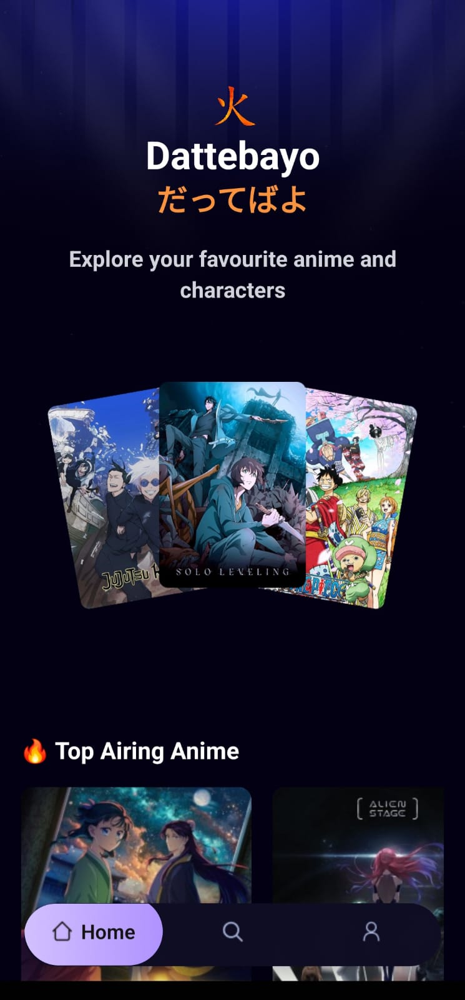
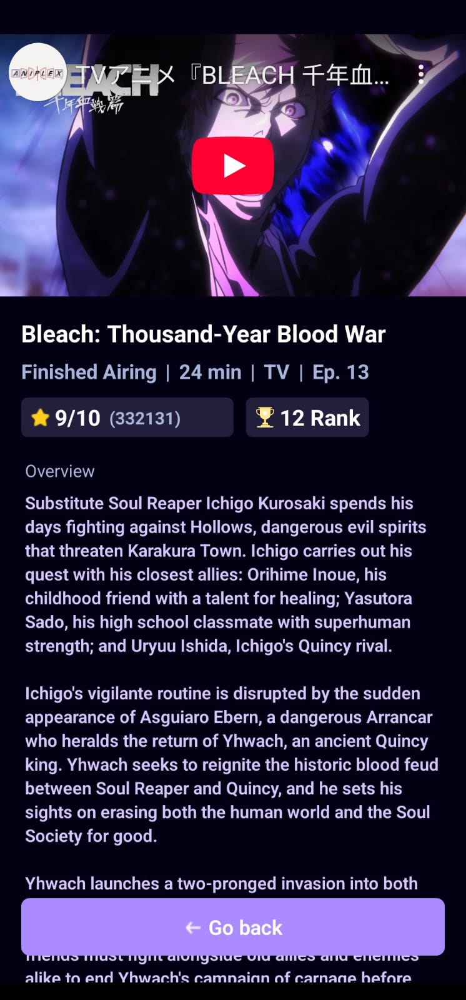

# Welcome to 🍥 Dattebayo — Anime Explorer App 👋
project created with [`create-expo-app`](https://www.npmjs.com/package/create-expo-app).

## 🖼️ Screenshots

<table>
  <tr>
    <th align="center">📱 Home Screen</th>
    <th align="center">📘 Anime Details</th>
  </tr>
  <tr>
    <td align="center">
      
    </td>
    <td align="center">
      
    </td>
  </tr>
</table>

**Dattebayo** is a modern anime browsing app built with **React Native**. It showcases the top trending and most popular anime, lets users explore detailed anime information, and delivers an immersive mobile experience — all powered by the [Jikan API](https://jikan.moe/).

---

## ✨ Features

- 🔥 **Trending Anime** – Discover what's hot in the anime world right now
- 📈 **Popular Anime** – Scroll through globally popular anime series
- 📖 **Anime Details** – View synopsis, genres, ratings, episodes, trailer and more
- 🎨 **Clean & Responsive UI** – for both Android and iOS

---

## 🛠 Tech Stack

- **React Native** (via [Expo](https://expo.dev/))
- **React Navigation**
- **[Jikan API](https://jikan.moe/)** – Unofficial MyAnimeList API
- **Tailwind CSS / NativeWind** – For rapid styling
- **TypeScript**

---
